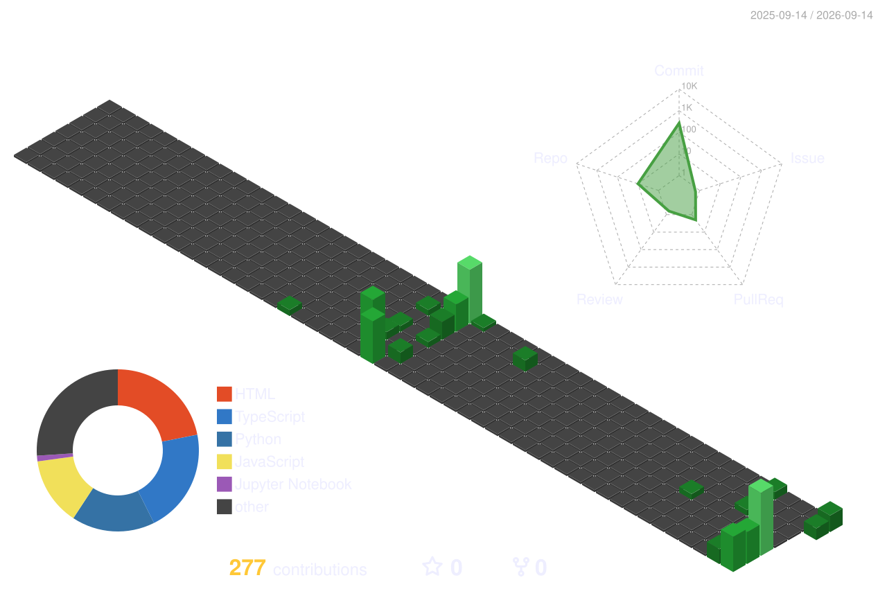

### Hi, I'm Shaurya Chopra 👋

---

### About Me

* 🔭 **Current Focus:** Working on **Slick Trace** — vessel source attribution for oil spills using SAR + AIS drift simulation.
* 👯 **Collaboration:** Looking to collaborate on open source AI engineering and cybersecurity projects.
* ⚡ **Fun Fact:** I love playing chess, table tennis and piano.

---

