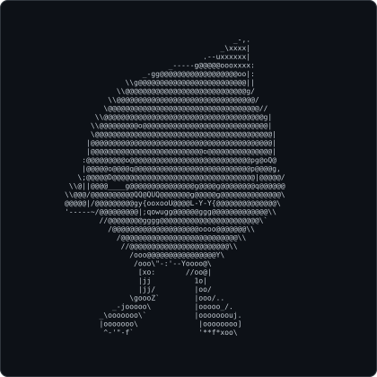

<table width="100%">
<tr>
<td style="width:20%; text-align:left;" valign="middle">

<picture>
  <source media="(prefers-color-scheme: dark)" srcset="dark_mode.svg" />
  <source media="(prefers-color-scheme: light)" srcset="light_mode.svg" />
  
</picture>

</td>
<td style="width:60%; text-align:center;" valign="middle">

### Hi, I'm Shaurya Chopra 👋

</td>
<td style="width:20%; text-align:right;" valign="middle">

<picture>
  <source media="(prefers-color-scheme: dark)" srcset="dark_mode2.svg?v=2" />
  <source media="(prefers-color-scheme: light)" srcset="light_mode2.svg?v=2" />
  
</picture>

</td>
</tr>
</table>

---

### About Me

* 🔭 **Current Focus:** Working on **slicktrace** — vessel-source attribution for oil spills using SAR + AIS drift simulation.
* 🌱 **Learning Journey:** Diving into SAR image processing, OpenDrift, and Geospatial Querying.
* 👯 **Collaboration:** Looking to collaborate on open source AI engineering and cybersecurity projects.
* 👨‍💻 **Portfolio:** Explore all my projects at **[shauryachopra.dev](https://shauryachopra.dev/)**.
* ⚡ **Fun Fact:** I love playing chess, table tennis and piano.

---

